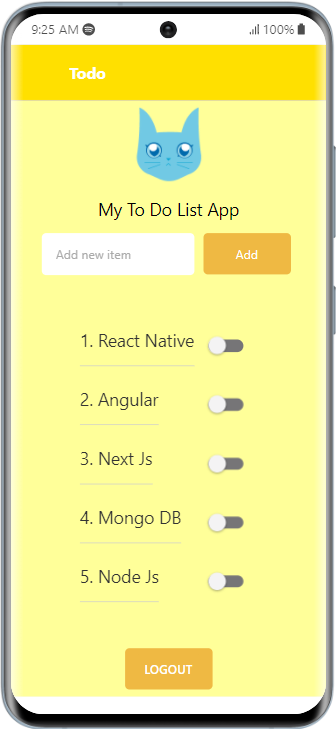
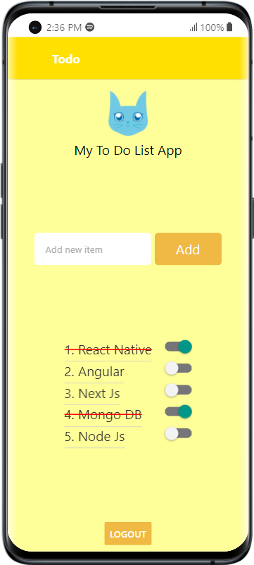
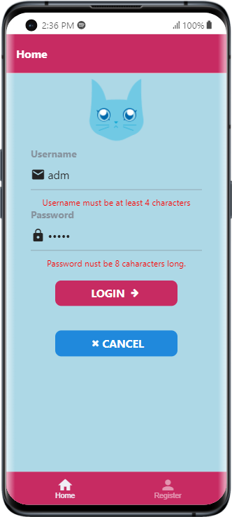
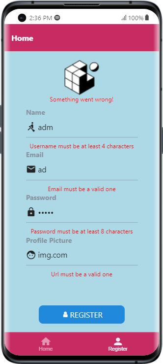

# ✍️React Native Todo App ✍️

# Todo Screen

 

# Home Screen

 

# Register Screen

 

### 1. Creating a new application
```
> expo init rn-todo 

☑️choose the blank template

     OR 
 
 if you clone this repo run

> npm install

> cd rn-todo

````
### 2. Dependencies

````

> npm install @react-navigation/native

> expo install react-native-screens react-native-safe-area-context

> npm install @react-navigation/native-stack

> npm install @react-navigation/bottom-tabs

> npm install @react-navigation/material-bottom-tabs react-native-paper react-native-vector-icons

````

### 3. Start your application

 Open a new terminal inside your React Native project folder. Run the following to Start Metro

````
> npm start

Username: admin
Password: PASSWORD
````

## [Source]

### Environment setup: https://reactnative.dev/docs/environment-setup

### Getting Started: https://reactnative.dev/docs/getting-started

### Navigation: https://reactnavigation.org/docs/getting-started

### Component: https://reactnative.dev/docs/components-and-apis

### Elements: https://reactnativeelements.com/docs
